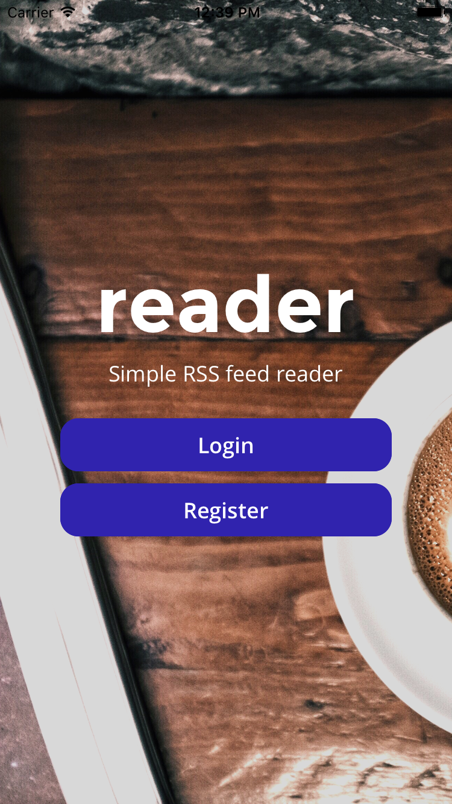
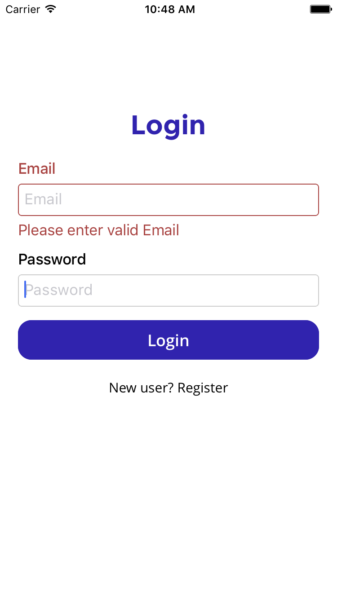
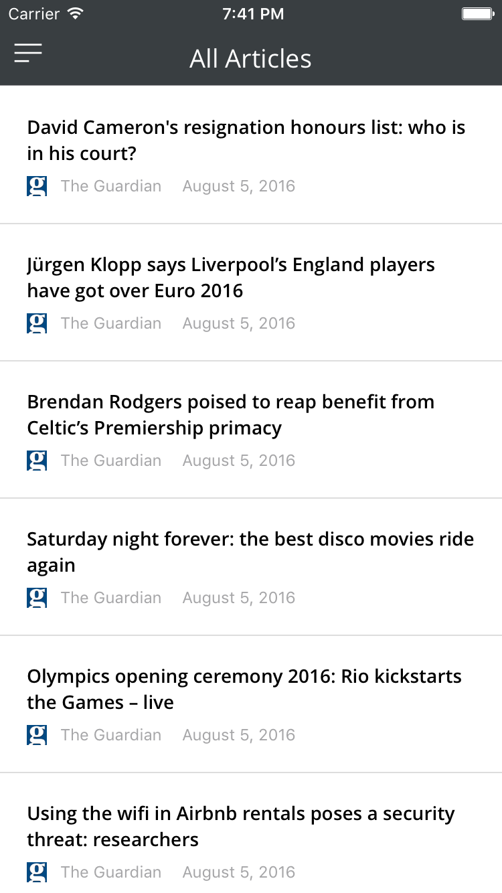
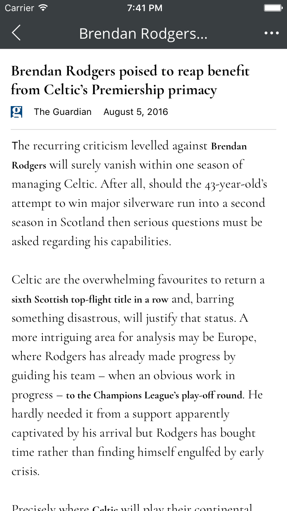

# reader (WIP)
Mobile version of rss reader using React Native

## Features

- [x] Subscribing to news feed
- [x] Clean article reader view 
- [ ] Add news feed/ rss feed
- [ ] Search Articles
- [ ] Marking as read/unread
- [ ] Marking as favourite
- [ ] Open article link in external browser

## Screens:

